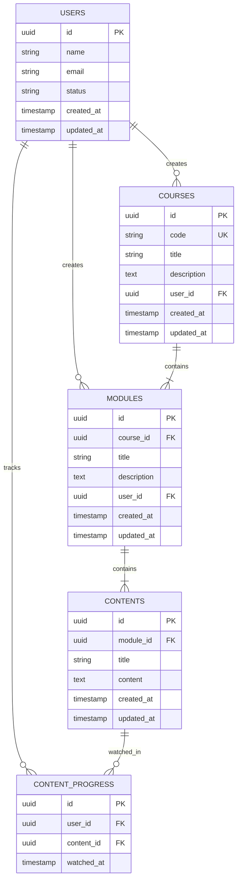

# Entity Relationship Diagram

```mermaid
erDiagram
  USERS ||--o{ COURSES : creates
  USERS ||--o{ MODULES : creates
  COURSES ||--|{ MODULES : contains
  MODULES ||--|{ CONTENTS : contains
  USERS ||--o{ CONTENT_PROGRESS : tracks
  CONTENTS ||--o{ CONTENT_PROGRESS : watched_in
  USERS { uuid id PK string name string email string status timestamp created_at timestamp updated_at }
  COURSES { uuid id PK string code UK string title text description uuid user_id FK timestamp created_at timestamp updated_at }
  MODULES { uuid id PK uuid course_id FK string title text description uuid user_id FK timestamp created_at timestamp updated_at }
  CONTENTS { uuid id PK uuid module_id FK string title text content timestamp created_at timestamp updated_at }
  CONTENT_PROGRESS { uuid id PK uuid user_id FK uuid content_id FK timestamp watched_at }
```
